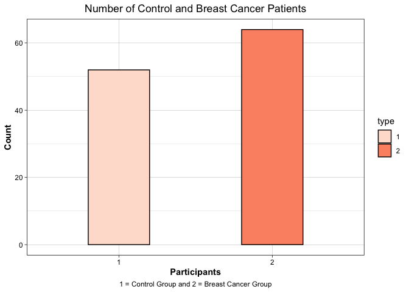
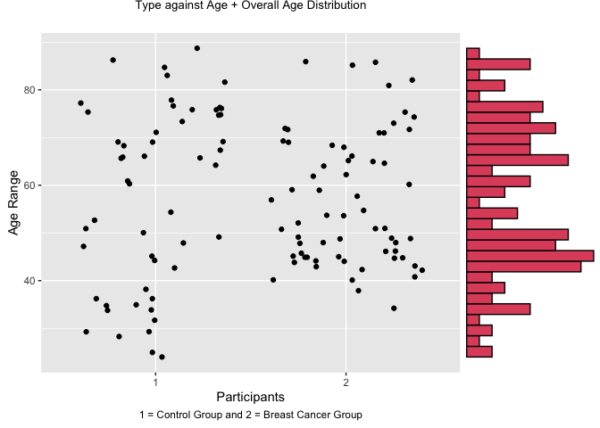
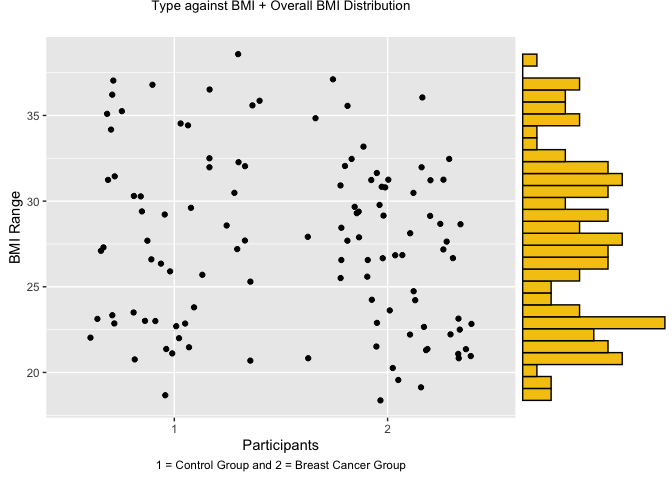
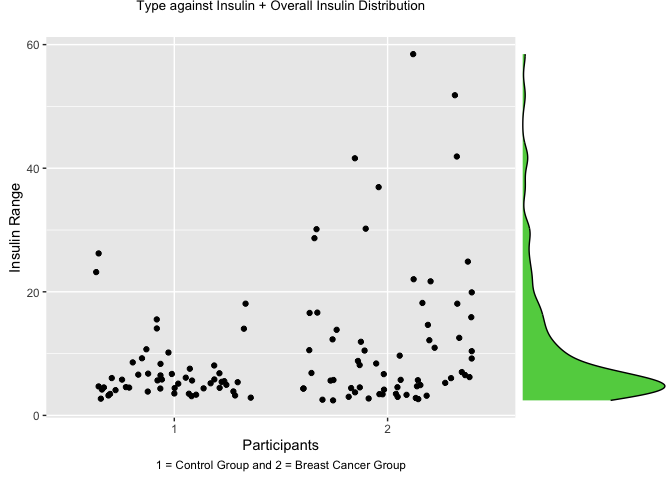

Breast Cancer ML Classifcation Linear Discriminant Analysis
================
Rex Manglicmot

-   <a href="#status-continuing-working-document"
    id="toc-status-continuing-working-document">Status: Continuing Working
    Document</a>
-   <a href="#introduction" id="toc-introduction">Introduction</a>
-   <a href="#loading-the-libraries" id="toc-loading-the-libraries">Loading
    the Libraries</a>
-   <a href="#loading-the-data" id="toc-loading-the-data">Loading the
    Data</a>
-   <a href="#cleaning-the-data" id="toc-cleaning-the-data">Cleaning the
    Data</a>
-   <a href="#exploratory-data-analysis"
    id="toc-exploratory-data-analysis">Exploratory Data Analysis</a>
-   <a href="#modeling-linear-discriminant-analysis"
    id="toc-modeling-linear-discriminant-analysis">Modeling: Linear
    Discriminant Analysis</a>
-   <a href="#limitations" id="toc-limitations">Limitations</a>
-   <a href="#conclusion" id="toc-conclusion">Conclusion</a>
-   <a href="#inspiration-for-this-project"
    id="toc-inspiration-for-this-project">Inspiration for this project</a>

## Status: Continuing Working Document

Hi everyone. I’m continuing building my data analysis and R skills. As
such, I would love feedback to better improve this project via
<rexmanglicmot@gmail.com>. Any mistakes and misrepresentation of the
data are my own.

Things Need To Do/Questions:

-   More concepts about LDA + include mathematical expressions and the
    verbal walkthrough of such.
-   Grammar.
-   Get feedback and incorporate
-   Fill in intro
-   How do I create a boxplot from all the quant columns against a
    column that has 2 categorical variables? I know how to do this
    within a single column, but not multiple. Ditto for bar charts?

## Introduction


There are many factors that attribute to formation cancer, but there is
one dominant factor among all cancers, and that is gene expression.
There are numerous studies that have shown that having a certain gene
may likely contribute to a formation of a certain cancer. The human
genome is estimated to have about 20,000 genes.[^1] These genes then go
through mechanisms of protein synthesis which in the end create a vast
array of proteins (estimated to be 20,000 or even more[^2]) and these
proteins then have the capability to form cells (and eventually cancer).

Studying genes and their expressions provide scientist the opportunity
to idneitfy which patients are susceptible to certain cancers.

The project is structured in the following chapters:

1.  Introduction
2.  Loading the Libraries
3.  Loading the Data
4.  Cleaning the Data
5.  Exploratory Data Analysis
6.  Modeling: Linear Discriminant Analysis
7.  Limitations
8.  Conclusion
9.  Inspiration for this project

A special acknowledgement to the University of Irvine Data Repository
for providing the dataset to the public.[^3] A special acknowledgement
for Miguel Patricio et al. from the Faculty of Medicine of the
University of Coimbra and also Manuel Gomes from the University Hospital
Centre of Coimbra for their research and for providing this dataset.

Within the dataset there are 10 variables:

1.  Age (years)
2.  BMI (kg/m2)
3.  Glucose (mg/dL)
4.  Insulin (µU/mL)
5.  HOMA
6.  Leptin (ng/mL)
7.  Adiponectin (µg/mL)
8.  Resistin (ng/mL)
9.  MCP-1(pg/dL)
10. Classification: 1-Healthy Controls and 2-BC Patients

## Loading the Libraries

``` r
#install.packages('data.table') #installed on 12/14/22
#install.packages('ggExtra')

#Load the libraries
library(tidyverse)
library(dplyr)
library(data.table)
library(corrplot)
library(ggExtra)
library(ggplot2)
```

## Loading the Data

``` r
#load the dataset
data <- read.csv('dataR2.csv')

#view the first few rows of the data
head(data, 10)
```

    ##    Age      BMI Glucose Insulin      HOMA  Leptin Adiponectin Resistin    MCP.1
    ## 1   48 23.50000      70   2.707 0.4674087  8.8071    9.702400  7.99585  417.114
    ## 2   83 20.69049      92   3.115 0.7068973  8.8438    5.429285  4.06405  468.786
    ## 3   82 23.12467      91   4.498 1.0096511 17.9393   22.432040  9.27715  554.697
    ## 4   68 21.36752      77   3.226 0.6127249  9.8827    7.169560 12.76600  928.220
    ## 5   86 21.11111      92   3.549 0.8053864  6.6994    4.819240 10.57635  773.920
    ## 6   49 22.85446      92   3.226 0.7320869  6.8317   13.679750 10.31760  530.410
    ## 7   89 22.70000      77   4.690 0.8907873  6.9640    5.589865 12.93610 1256.083
    ## 8   76 23.80000     118   6.470 1.8832013  4.3110   13.251320  5.10420  280.694
    ## 9   73 22.00000      97   3.350 0.8015433  4.4700   10.358725  6.28445  136.855
    ## 10  75 23.00000      83   4.952 1.0138395 17.1270   11.578990  7.09130  318.302
    ##    Classification
    ## 1               1
    ## 2               1
    ## 3               1
    ## 4               1
    ## 5               1
    ## 6               1
    ## 7               1
    ## 8               1
    ## 9               1
    ## 10              1

``` r
#look at the number of the rows and columns we have
dim(data)
```

    ## [1] 116  10

The dataset has the 10 variables and 116 observations. So far we were
able to download the data correctly.

## Cleaning the Data

Let’s create a new object of the orginal data and change the variable
names. Some of them like Classification are too long and let’s change
them to a name much shorter.

``` r
#store data into a new object for data cleaning
data2 <- data

#change variable name to lowercase
names(data2) <- tolower(names(data2))

#change variable name to 3-4 words
names(data2)[3:10] <- c('glu', 'ins', 'hom', 'lep', 'adi', 'res', 'mcp', 'type')
```

Let’s inspect our data for any NA values and see all the variables are
correctly classed.

``` r
#check for any NA values
sum(is.na(data2))
```

    ## [1] 0

``` r
#another method to check for NA values
any(is.na(data2))
```

    ## [1] FALSE

``` r
#check to see if there are any alphabet letters in the dataframe since we are dealing with a quant dataset
sapply(sapply(data2, grep, pattern = "[a-z]+"), length)
```

    ##  age  bmi  glu  ins  hom  lep  adi  res  mcp type 
    ##    0    0    0    0    0    0    0    0    0    0

``` r
#check class other than str function
data.frame(sapply(data2,class))
```

    ##      sapply.data2..class.
    ## age               integer
    ## bmi               numeric
    ## glu               integer
    ## ins               numeric
    ## hom               numeric
    ## lep               numeric
    ## adi               numeric
    ## res               numeric
    ## mcp               numeric
    ## type              integer

Everything looks ok except for the type variable; it needs to be a
factor.

``` r
#change last column to a factor
data2$type=as.factor(data2$type)

#check if it was changed
class(data2$type)
```

    ## [1] "factor"

Now, let’s explore!

## Exploratory Data Analysis

``` r
summary(data2)
```

    ##       age            bmi             glu              ins        
    ##  Min.   :24.0   Min.   :18.37   Min.   : 60.00   Min.   : 2.432  
    ##  1st Qu.:45.0   1st Qu.:22.97   1st Qu.: 85.75   1st Qu.: 4.359  
    ##  Median :56.0   Median :27.66   Median : 92.00   Median : 5.925  
    ##  Mean   :57.3   Mean   :27.58   Mean   : 97.79   Mean   :10.012  
    ##  3rd Qu.:71.0   3rd Qu.:31.24   3rd Qu.:102.00   3rd Qu.:11.189  
    ##  Max.   :89.0   Max.   :38.58   Max.   :201.00   Max.   :58.460  
    ##       hom               lep              adi              res        
    ##  Min.   : 0.4674   Min.   : 4.311   Min.   : 1.656   Min.   : 3.210  
    ##  1st Qu.: 0.9180   1st Qu.:12.314   1st Qu.: 5.474   1st Qu.: 6.882  
    ##  Median : 1.3809   Median :20.271   Median : 8.353   Median :10.828  
    ##  Mean   : 2.6950   Mean   :26.615   Mean   :10.181   Mean   :14.726  
    ##  3rd Qu.: 2.8578   3rd Qu.:37.378   3rd Qu.:11.816   3rd Qu.:17.755  
    ##  Max.   :25.0503   Max.   :90.280   Max.   :38.040   Max.   :82.100  
    ##       mcp          type  
    ##  Min.   :  45.84   1:52  
    ##  1st Qu.: 269.98   2:64  
    ##  Median : 471.32         
    ##  Mean   : 534.65         
    ##  3rd Qu.: 700.09         
    ##  Max.   :1698.44

``` r
# ggplot(data2, aes(x=type, color =(.))) +
#   geom_boxplot()
```

``` r
#create barcharts
ggplot(data2, aes(type, fill= type)) +
  geom_bar(width = .4, color='black') +
  theme_linedraw() +
 scale_fill_brewer(palette="Reds") +
  labs(title = 'Number of Control and Breast Cancer Patients',
       x = 'Participants',
       caption = '1 = Control Group and 2 = Breast Cancer Group',
       y = 'Count') +
  theme(plot.title = element_text(hjust = 0.5),
        plot.caption = element_text(hjust = 0.5),
        axis.title = element_text(face = "bold"))
```

<!-- -->

``` r
# 
# data3 <- data2 %>%
#   group_by(type) %>%
#   summarise(across(everything(), mean),
#             .groups = 'drop') %>%
#   as.data.frame()
# 
# names(data4)
#   
# data4 <- data4[-1, ] %>%
#   rename('1' = c1,
#          '2' = c2)
# 
# ggplot(data4, aes(x=1)) +
#   geom_bar()
```

``` r
# ggplot(data4, aes(x=V1, y=V2)) +
#   geom_bar()
```

``` r
g <- ggplot(data2, aes(x=type, y=age)) +
  geom_point(position = 'jitter', color = 'black') +
  theme_gray() +
   labs(title = 'Type against Age + Overall Age Distribution',
       x = 'Participants',
       caption = '1 = Control Group and 2 = Breast Cancer Group',
       y = 'Age Range') +
  theme(plot.title = element_text(hjust = 0.5, size=10),
        plot.caption = element_text(hjust = 0.5))

ggMarginal(g, type = 'histogram',
           margins = 'y',
           size = 3,
           fill=2)
```

<!-- -->

``` r
g2 <- ggplot(data2, aes(x=type, y=bmi)) +
  geom_point(position = 'jitter') +
  theme_gray() +
   labs(title = 'Type against BMI + Overall BMI Distribution',
       x = 'Participants',
       caption = '1 = Control Group and 2 = Breast Cancer Group',
       y = 'BMI Range') +
  theme(plot.title = element_text(hjust = 0.5, size=10),
        plot.caption = element_text(hjust = 0.5))

ggMarginal(g2, type = 'histogram',
           margins = 'y',
           size = 3,
           fill=7)
```

<!-- -->

``` r
g3 <- ggplot(data2, aes(x=type, y=glu)) +
  geom_point(position = 'jitter', color = 'black') +
  theme_gray() +
   labs(title = 'Type against Glucose + Overall Glucose Distribution',
       x = 'Participants',
       caption = '1 = Control Group and 2 = Breast Cancer Group',
       y = 'Glucose Range') +
  theme(plot.title = element_text(hjust = 0.5, size=10),
        plot.caption = element_text(hjust = 0.5))

ggMarginal(g3, type = 'density',
           margins = 'y',
           size = 3,
           fill=13)
```

<!-- -->

``` r
g4 <- ggplot(data2, aes(x=type, y=ins)) +
  geom_point(position = 'jitter', color = 'black') +
  theme_gray() +
   labs(title = 'Type against Insulin + Overall Insulin Distribution',
       x = 'Participants',
       caption = '1 = Control Group and 2 = Breast Cancer Group',
       y = 'Insulin Range') +
  theme(plot.title = element_text(hjust = 0.5, size=10),
        plot.caption = element_text(hjust = 0.5))

ggMarginal(g4, type = 'density',
           margins = 'y',
           size = 3,
           fill=3)
```

<!-- -->

## Modeling: Linear Discriminant Analysis


**Linear Discriminant Analysis** is a dimensional reduction technique
used to separate two or more classes.[^4] The goal is to project the
data onto a *lower-dimensional space* that has decent class
separability.[^5]

LDA is a type of dimensional reduction technique that reduces the number
of dimensions in the dataset.[^6] The objective is to reduce a high
dimensional dataset to a lower dimensional space and to have separation
between classes (therefore, our classification)[^7] Recall that
Multidimensional data has many features (i.e. variables) that be are
correlated to one another and dimensional reduction reduces this to 2 or
3 dimensions.[^8]

I decided to pput this in another object for closer inspection and saw
that 267 variables out of the 20531 variables had zero values. Now let’s
get rid of this of these columns and create a new object, data4, that
contains all non-zero, numeric values.

Below are the Steps to do an LDA[^9]:

1.  Compute Mean vectors of each class of dependent variables

2.  Compute with-in class and between-class scatter matrices

3.  Compute Eigenvalues and Eigenvector for SW and SB

4.  Sort the Eigenvalues in discending order and select the top k

5.  Create a new matrix containing eignevectors that map the k
    eigenvalues

6.  Contain the new features (linear discriminants) by taking the dot
    plot of the data and the matrix.


## Limitations

## Conclusion

## Inspiration for this project

[^1]: <https://sitn.hms.harvard.edu/flash/2012/issue127a/>

[^2]: <https://theconversation.com/what-is-a-protein-a-biologist-explains-152870#>:\~:text=Scientists%20are%20not%20exactly%20sure,causing%20your%20muscles%20to%20work.

[^3]: <https://archive.ics.uci.edu/ml/datasets/Breast+Cancer+Coimbra>

[^4]: <https://www.geeksforgeeks.org/ml-linear-discriminant-analysis/#>:\~:text=Linear%20Discriminant%20Analysis%20or%20Normal,separating%20two%20or%20more%20classes.

[^5]: <https://sebastianraschka.com/Articles/2014_python_lda.html>

[^6]: <https://www.mygreatlearning.com/blog/linear-discriminant-analysis-or-lda/>

[^7]: <https://www.digitalvidya.com/blog/linear-discriminant-analysis/>

[^8]: <https://www.digitalvidya.com/blog/linear-discriminant-analysis/>

[^9]: <https://www.mygreatlearning.com/blog/linear-discriminant-analysis-or-lda/>
